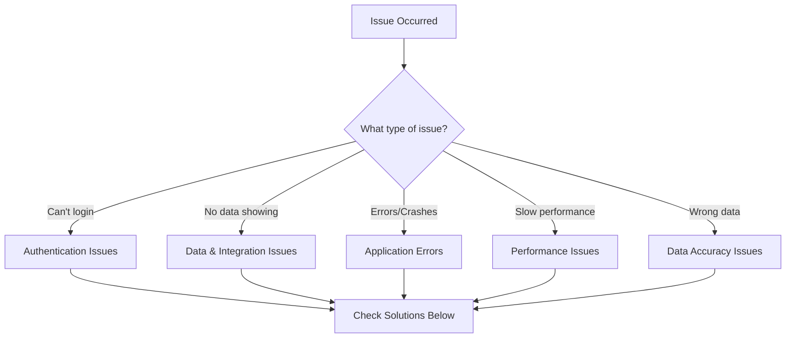

# Troubleshooting Guide

## Overview

This comprehensive troubleshooting guide helps you resolve common issues with the Shopify SEO Analyzer platform. Follow the structured approach to quickly identify and fix problems.

## Quick Diagnosis



## Table of Contents

1. [Authentication Issues](#authentication-issues)
2. [Data & Integration Issues](#data--integration-issues)
3. [Application Errors](#application-errors)
4. [Performance Issues](#performance-issues)
5. [Data Accuracy Issues](#data-accuracy-issues)
6. [API & Rate Limiting](#api--rate-limiting)
7. [Database Issues](#database-issues)
8. [Deployment Issues](#deployment-issues)
9. [Browser & Client Issues](#browser--client-issues)
10. [Emergency Procedures](#emergency-procedures)

---

## 1. Authentication Issues

### Cannot Login

#### Symptoms
- Login button doesn't work
- "Invalid credentials" error
- Redirect loops
- Session expires immediately

#### Diagnosis
```bash
# Check authentication service
curl -X POST https://yourdomain.com/api/auth/login \
  -H "Content-Type: application/json" \
  -d '{"email":"test@example.com","password":"test"}'

# Check session storage
redis-cli ping
redis-cli get "sess:*"
```

#### Solutions

**1. Password Reset Issues**
```javascript
// Manually reset password via database
UPDATE users 
SET password_hash = '$2b$10$hashedpassword' 
WHERE email = 'user@example.com';

// Generate new password hash
const bcrypt = require('bcrypt');
const newHash = await bcrypt.hash('newpassword', 10);
```

**2. OAuth/Google Login Failed**
- Verify OAuth credentials in Google Console
- Check redirect URIs match exactly
- Ensure cookies are enabled
- Clear browser cache
- Try incognito mode

**3. Session Problems**
```javascript
// Check Redis connection
const redis = require('redis');
const client = redis.createClient({
  url: process.env.REDIS_URL
});

client.on('error', (err) => console.log('Redis Error', err));
await client.connect();
await client.ping();
```

### Two-Factor Authentication Issues

#### Lost Authenticator App
1. Use backup codes
2. Contact admin for manual disable
3. Database command to disable 2FA:
```sql
UPDATE users 
SET two_factor_enabled = false, 
    two_factor_secret = NULL 
WHERE email = 'user@example.com';
```

---

## 2. Data & Integration Issues

### No Data Showing

#### Google Search Console Data Missing

**Symptoms:**
- Empty keyword rankings
- No search analytics data
- "No data available" message

**Diagnosis:**
```javascript
// Test Search Console API
const { google } = require('googleapis');
const auth = new google.auth.GoogleAuth({
  keyFile: './service-account-key.json',
  scopes: ['https://www.googleapis.com/auth/webmasters.readonly'],
});

const searchconsole = google.searchconsole('v1');
const authClient = await auth.getClient();

try {
  const sites = await searchconsole.sites.list({ auth: authClient });
  console.log('Available sites:', sites.data);
} catch (error) {
  console.error('API Error:', error);
}
```

**Solutions:**
1. **Verify Domain Ownership**
   - Go to Search Console
   - Re-verify domain ownership
   - Add service account as user

2. **Check Permissions**
   - Service account needs "Full" access
   - Not just "Restricted" access

3. **Data Delay**
   - Search Console data has 2-3 day delay
   - Wait 48 hours after setup

### Google Analytics Data Missing

**Common Causes:**
1. Wrong Property ID
2. Insufficient permissions
3. Data sampling issues
4. View filters blocking data

**Solutions:**
```javascript
// Verify Analytics connection
const analytics = google.analyticsdata('v1beta');
try {
  const response = await analytics.properties.runReport({
    property: `properties/${propertyId}`,
    auth: authClient,
    requestBody: {
      dateRanges: [{ startDate: '7daysAgo', endDate: 'today' }],
      metrics: [{ name: 'sessions' }],
    },
  });
  console.log('Analytics data:', response.data);
} catch (error) {
  console.error('Analytics error:', error);
}
```

### Shopify Integration Issues

#### Products Not Syncing

**Diagnosis:**
```bash
# Test Shopify API connection
curl -X GET "https://your-store.myshopify.com/admin/api/2024-01/products.json" \
  -H "X-Shopify-Access-Token: your-access-token"
```

**Solutions:**
1. **Re-authenticate:**
   ```javascript
   // Force re-authentication
   DELETE FROM shopify_sessions WHERE store_domain = 'your-store.myshopify.com';
   ```

2. **Check Webhook Registration:**
   ```javascript
   // List registered webhooks
   const webhooks = await shopify.webhook.list();
   console.log('Registered webhooks:', webhooks);
   
   // Re-register if missing
   await shopify.webhook.create({
     topic: 'products/update',
     address: 'https://yourdomain.com/webhooks/shopify/products/update',
   });
   ```

3. **API Version Mismatch:**
   - Update to latest stable API version
   - Check deprecation notices

---

## 3. Application Errors

### 500 Internal Server Error

#### Diagnosis Steps
1. Check error logs
2. Review recent changes
3. Test database connection
4. Verify environment variables

#### Common Causes and Solutions

**1. Database Connection Failed**
```javascript
// Test database connection
const { Pool } = require('pg');
const pool = new Pool({
  connectionString: process.env.DATABASE_URL,
});

try {
  const client = await pool.connect();
  await client.query('SELECT 1');
  client.release();
  console.log('Database connected');
} catch (error) {
  console.error('Database error:', error);
}
```

**2. Missing Environment Variables**
```bash
# Check all required variables
node -e "
const required = [
  'DATABASE_URL',
  'REDIS_URL',
  'JWT_SECRET',
  'GOOGLE_CLIENT_ID',
  'SHOPIFY_API_KEY'
];
required.forEach(key => {
  if (!process.env[key]) {
    console.error('Missing:', key);
  }
});
"
```

**3. Memory Issues**
```javascript
// Monitor memory usage
console.log('Memory usage:', process.memoryUsage());

// Increase Node.js memory limit
node --max-old-space-size=4096 server.js
```

### 404 Not Found Errors

**For API Endpoints:**
```javascript
// List all registered routes
app._router.stack.forEach(function(r){
  if (r.route && r.route.path){
    console.log(r.route.path)
  }
});
```

**For Static Files:**
- Check file paths
- Verify build process
- Ensure nginx configuration

### CORS Errors

**Symptoms:**
- "Access-Control-Allow-Origin" errors
- Blocked requests from frontend

**Solutions:**
```javascript
// Update CORS configuration
app.use(cors({
  origin: [
    'http://localhost:3000',
    'https://yourdomain.com',
    'https://www.yourdomain.com'
  ],
  credentials: true,
  methods: ['GET', 'POST', 'PUT', 'DELETE', 'OPTIONS'],
  allowedHeaders: ['Content-Type', 'Authorization', 'X-Requested-With'],
}));
```

---

## 4. Performance Issues

### Slow Page Load

#### Diagnosis Tools
```bash
# Check server response time
time curl -o /dev/null -s -w "%{time_total}\n" https://yourdomain.com

# Monitor Node.js performance
node --inspect server.js
# Open chrome://inspect
```

#### Common Causes

**1. Database Queries**
```sql
-- Find slow queries
SELECT 
  query,
  calls,
  total_time,
  mean,
  max
FROM pg_stat_statements
WHERE mean > 100
ORDER BY mean DESC
LIMIT 10;

-- Add missing indexes
CREATE INDEX idx_keywords_website_position 
ON keywords(website_id, current_position) 
WHERE current_position IS NOT NULL;
```

**2. Memory Leaks**
```javascript
// Monitor memory usage
setInterval(() => {
  const usage = process.memoryUsage();
  console.log(`Memory: RSS=${usage.rss/1024/1024}MB, Heap=${usage.heapUsed/1024/1024}MB`);
}, 60000);

// Use memory profiler
require('v8').writeHeapSnapshot();
```

**3. API Rate Limiting**
```javascript
// Implement caching
const cache = new Map();

async function getCachedData(key, fetchFunction, ttl = 3600) {
  if (cache.has(key)) {
    const { data, timestamp } = cache.get(key);
    if (Date.now() - timestamp < ttl * 1000) {
      return data;
    }
  }
  
  const data = await fetchFunction();
  cache.set(key, { data, timestamp: Date.now() });
  return data;
}
```

### High CPU Usage

**Diagnosis:**
```bash
# Monitor CPU usage
top -p $(pgrep -f node)

# Profile CPU usage
node --prof server.js
# Process profile
node --prof-process isolate-*.log > profile.txt
```

**Solutions:**
1. Optimize algorithms
2. Implement worker threads
3. Use clustering
4. Cache computed results

---

## 5. Data Accuracy Issues

### Keyword Rankings Don't Match

**Common Reasons:**
1. Personalization
2. Location differences
3. Mobile vs Desktop
4. Time of check

**Debugging:**
```javascript
// Compare ranking check
async function debugRanking(keyword, url) {
  // Check via API
  const apiRanking = await checkRankingAPI(keyword, url);
  
  // Manual check (incognito)
  console.log('API Ranking:', apiRanking);
  console.log('Check manually in incognito mode');
  console.log(`Search: ${keyword}`);
  console.log('Location:', process.env.SEARCH_LOCATION);
  console.log('Device:', process.env.SEARCH_DEVICE);
}
```

### Analytics Data Mismatch

**Verify Data Sources:**
```javascript
// Compare data sources
async function compareAnalytics(date) {
  const gaData = await getGoogleAnalytics(date);
  const dbData = await getDatabaseAnalytics(date);
  
  console.log('GA Sessions:', gaData.sessions);
  console.log('DB Sessions:', dbData.sessions);
  console.log('Difference:', Math.abs(gaData.sessions - dbData.sessions));
}
```

**Common Issues:**
1. Timezone differences
2. Filtering differences
3. Sampling in GA
4. Bot traffic

---

## 6. API & Rate Limiting

### API Quota Exceeded

#### Google APIs
```javascript
// Check quota usage
async function checkQuotaUsage() {
  try {
    // Make minimal API call
    await googleAPI.test();
  } catch (error) {
    if (error.code === 429) {
      console.error('Quota exceeded');
      console.log('Reset time:', error.retryAfter);
    }
  }
}

// Implement exponential backoff
async function retryWithBackoff(fn, maxRetries = 5) {
  for (let i = 0; i < maxRetries; i++) {
    try {
      return await fn();
    } catch (error) {
      if (error.code !== 429 || i === maxRetries - 1) throw error;
      await new Promise(resolve => setTimeout(resolve, Math.pow(2, i) * 1000));
    }
  }
}
```

#### Shopify API
```javascript
// Handle rate limits
axios.interceptors.response.use(
  response => response,
  async error => {
    if (error.response?.status === 429) {
      const retryAfter = error.response.headers['retry-after'] || 2;
      await new Promise(resolve => setTimeout(resolve, retryAfter * 1000));
      return axios.request(error.config);
    }
    return Promise.reject(error);
  }
);
```

### Webhook Failures

**Debug Webhooks:**
```javascript
// Log webhook attempts
app.post('/webhooks/*', (req, res, next) => {
  console.log('Webhook received:', {
    topic: req.get('X-Shopify-Topic'),
    shop: req.get('X-Shopify-Shop-Domain'),
    timestamp: new Date().toISOString()
  });
  next();
});

// Verify webhook signature
function verifyWebhook(rawBody, signature) {
  const hash = crypto
    .createHmac('sha256', process.env.SHOPIFY_WEBHOOK_SECRET)
    .update(rawBody, 'utf8')
    .digest('base64');
  
  return hash === signature;
}
```

---

## 7. Database Issues

### Connection Pool Exhausted

**Symptoms:**
- "too many connections" error
- Timeouts on database queries
- Application hangs

**Solutions:**
```javascript
// Monitor pool usage
pool.on('connect', () => {
  console.log('Pool: New client connected');
  console.log('Total:', pool.totalCount);
  console.log('Idle:', pool.idleCount);
  console.log('Waiting:', pool.waitingCount);
});

// Properly release connections
async function queryDatabase(query, params) {
  const client = await pool.connect();
  try {
    return await client.query(query, params);
  } finally {
    client.release();
  }
}

// Configure pool settings
const pool = new Pool({
  max: 20,
  idleTimeoutMillis: 30000,
  connectionTimeoutMillis: 2000,
});
```

### Migration Failures

**Rollback Procedure:**
```bash
# Check migration status
SELECT * FROM migrations ORDER BY executed_at DESC;

# Rollback last migration
npm run migrate:down

# Manual rollback
psql -U user -d database -f migrations/rollback/001_rollback.sql
```

### Data Corruption

**Recovery Steps:**
1. Stop application
2. Backup current state
3. Identify corrupted data
4. Restore from backup
5. Replay recent changes

```sql
-- Find potential issues
SELECT * FROM keywords 
WHERE current_position < 0 
   OR current_position > 100;

-- Fix data inconsistencies
UPDATE keywords 
SET current_position = NULL 
WHERE current_position < 0;
```

---

## 8. Deployment Issues

### Docker Container Crashes

**Diagnosis:**
```bash
# Check container logs
docker logs shopify-seo-analyzer --tail 100

# Inspect container
docker inspect shopify-seo-analyzer

# Check resource usage
docker stats shopify-seo-analyzer
```

**Common Fixes:**
```yaml
# Increase memory limits
services:
  app:
    deploy:
      resources:
        limits:
          memory: 4G
        reservations:
          memory: 2G
```

### SSL Certificate Issues

**Renew Certificates:**
```bash
# Test renewal
certbot renew --dry-run

# Force renewal
certbot renew --force-renewal

# Manual renewal
certbot certonly --nginx -d yourdomain.com -d www.yourdomain.com
```

### Build Failures

**Common Issues:**
1. Out of memory during build
2. Dependency conflicts
3. Missing environment variables

**Solutions:**
```bash
# Clear cache and rebuild
docker system prune -a
docker-compose build --no-cache

# Build with more memory
docker build --memory=4g -t app .
```

---

## 9. Browser & Client Issues

### JavaScript Errors

**Debug in Console:**
```javascript
// Enable verbose logging
localStorage.setItem('debug', '*');

// Check for errors
window.addEventListener('error', (e) => {
  console.error('Global error:', e);
});

window.addEventListener('unhandledrejection', (e) => {
  console.error('Unhandled promise rejection:', e);
});
```

### Cache Issues

**Force Refresh:**
1. Hard refresh: Ctrl+Shift+R (Cmd+Shift+R on Mac)
2. Clear site data:
   ```javascript
   // In browser console
   localStorage.clear();
   sessionStorage.clear();
   caches.keys().then(names => {
     names.forEach(name => caches.delete(name));
   });
   ```

### Browser Compatibility

**Test Compatibility:**
```javascript
// Check browser support
const checkSupport = () => {
  const required = {
    'Promises': typeof Promise !== 'undefined',
    'Fetch API': typeof fetch !== 'undefined',
    'LocalStorage': typeof localStorage !== 'undefined',
    'ES6': checkES6Support(),
  };
  
  Object.entries(required).forEach(([feature, supported]) => {
    if (!supported) {
      console.error(`Missing support for: ${feature}`);
    }
  });
};
```

---

## 10. Emergency Procedures

### Application Down

**Immediate Actions:**
1. Check server status
2. Review error logs
3. Check external services
4. Implement temporary fix
5. Notify users

**Quick Recovery Script:**
```bash
#!/bin/bash
# emergency-restart.sh

echo "🚨 Emergency restart initiated"

# Stop all services
docker-compose down

# Clear any locks
redis-cli FLUSHDB

# Start services
docker-compose up -d

# Wait for health check
sleep 30

# Verify services
curl -f http://localhost/health || {
  echo "❌ Health check failed"
  exit 1
}

echo "✅ Services restored"
```

### Data Loss Prevention

**Emergency Backup:**
```bash
#!/bin/bash
# emergency-backup.sh

DATE=$(date +%Y%m%d_%H%M%S)
BACKUP_DIR="/emergency-backups"

# Backup database
pg_dump -U $DB_USER -h $DB_HOST $DB_NAME | gzip > $BACKUP_DIR/db_emergency_$DATE.sql.gz

# Backup Redis
redis-cli --rdb $BACKUP_DIR/redis_emergency_$DATE.rdb

# Backup uploaded files
tar -czf $BACKUP_DIR/files_emergency_$DATE.tar.gz /app/uploads

echo "Emergency backup completed: $DATE"
```

### Security Breach

**Immediate Response:**
1. Isolate affected systems
2. Reset all credentials
3. Review access logs
4. Notify users if needed
5. Implement fixes

```sql
-- Lock all user accounts
UPDATE users SET account_locked = true;

-- Force password reset
UPDATE users SET force_password_reset = true;

-- Revoke all sessions
DELETE FROM sessions;
```

---

## Logging & Debugging

### Enable Debug Mode

```javascript
// Set debug environment
process.env.DEBUG = '*';
process.env.LOG_LEVEL = 'debug';

// Enhanced logging
const debug = require('debug')('app:*');
debug('Debugging enabled');
```

### Log Analysis

```bash
# Find errors in logs
grep -i error /var/log/app/*.log

# Count errors by type
awk '/ERROR/ {print $5}' app.log | sort | uniq -c | sort -nr

# Monitor logs in real-time
tail -f /var/log/app/error.log | grep -E "(ERROR|CRITICAL)"
```

---

## Getting Additional Help

### Before Contacting Support

1. Check this troubleshooting guide
2. Review recent changes
3. Collect error messages
4. Note steps to reproduce
5. Check system status page

### Information to Provide

```markdown
## Support Request Template

**Environment:**
- URL: 
- Browser/Version: 
- User Account: 
- Time of Issue: 

**Issue Description:**
[Detailed description]

**Steps to Reproduce:**
1. 
2. 
3. 

**Expected Result:**
[What should happen]

**Actual Result:**
[What actually happens]

**Error Messages:**
```
[Include full error messages]
```

**Screenshots:**
[Attach if relevant]

**Logs:**
```
[Relevant log entries]
```
```

### Support Channels

- 🚨 **Critical Issues**: emergency@yourdomain.com
- 📧 **General Support**: support@yourdomain.com
- 💬 **Live Chat**: Available 9 AM - 6 PM EST
- 📞 **Phone** (Enterprise): +1-xxx-xxx-xxxx
- 🌐 **Status Page**: status.yourdomain.com

---

**Remember**: Most issues can be resolved by following this guide systematically. Always backup before making changes! 🛡️