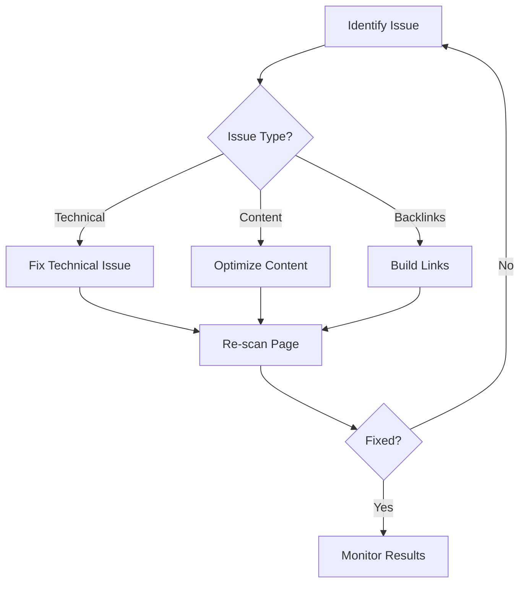

# Shopify SEO Analyzer - User Guide

## Welcome! 👋

This comprehensive guide will help you master the Shopify SEO Analyzer platform to improve your store's search engine visibility and drive more organic traffic.

## Table of Contents

1. [Getting Started](#getting-started)
2. [Dashboard Overview](#dashboard-overview)
3. [Keyword Tracking](#keyword-tracking)
4. [Technical SEO Analysis](#technical-seo-analysis)
5. [Analytics & Insights](#analytics--insights)
6. [Competitor Analysis](#competitor-analysis)
7. [Settings & Configuration](#settings--configuration)
8. [Best Practices](#best-practices)
9. [Troubleshooting](#troubleshooting)
10. [FAQ](#frequently-asked-questions)

---

## 1. Getting Started

### First-Time Setup

#### Step 1: Account Creation

1. Visit [https://yourdomain.com/signup](https://yourdomain.com/signup)
2. Click "Sign up with Google" or enter your email
3. Verify your email address
4. Complete your profile information

#### Step 2: Connect Your Shopify Store

1. Navigate to **Settings > Integrations**
2. Click "Connect Shopify Store"
3. Enter your store URL (e.g., `mystore.myshopify.com`)
4. Authorize the app when redirected to Shopify
5. Wait for initial data sync (usually 5-10 minutes)

#### Step 3: Connect Google Services

1. Go to **Settings > Google Integration**
2. Click "Connect Google Account"
3. Select the Google account associated with:
   - Google Search Console
   - Google Analytics
   - Google My Business (optional)
4. Grant necessary permissions
5. Select your website property

#### Step 4: Initial Configuration

1. Set your target market/region
2. Define your main competitors (3-5 recommended)
3. Set up notification preferences
4. Configure your SEO goals

### Understanding the Interface

```
┌─────────────────────────────────────────────────────┐
│  🏪 Shopify SEO Analyzer        👤 Your Account    │
├─────────────────────────────────────────────────────┤
│  📊 Dashboard  📈 Keywords  🔧 Technical  📉 Analytics │
├─────────────────────────────────────────────────────┤
│                                                     │
│            Main Content Area                        │
│                                                     │
└─────────────────────────────────────────────────────┘
```

---

## 2. Dashboard Overview

### Key Metrics

The dashboard provides a real-time overview of your SEO performance:

#### SEO Health Score

- **90-100**: Excellent - Your site is well-optimized
- **70-89**: Good - Minor improvements needed
- **50-69**: Fair - Several areas need attention
- **Below 50**: Poor - Significant optimization required

#### Traffic Overview

- **Organic Sessions**: Visitors from search engines
- **Conversion Rate**: Percentage of visitors who make purchases
- **Average Position**: Your average ranking in search results
- **Click-Through Rate**: How often people click your listings

### Dashboard Widgets

#### 1. Quick Stats
```
┌─────────────┬─────────────┬─────────────┬─────────────┐
│ Organic     │ Keywords    │ Technical   │ Page Speed  │
│ Traffic     │ Tracked     │ Issues      │ Score       │
│ ↑ 25%       │ 150         │ 3 Critical  │ 85/100      │
└─────────────┴─────────────┴─────────────┴─────────────┘
```

#### 2. Traffic Trends
- Daily/Weekly/Monthly views
- Compare periods
- Identify patterns and seasonality

#### 3. Top Performing Pages
- Pages driving most organic traffic
- Conversion rates by page
- Improvement opportunities

#### 4. Recent Alerts
- Critical SEO issues
- Ranking changes
- Competitor updates

### Customizing Your Dashboard

1. Click the **⚙️ Customize** button
2. Drag and drop widgets
3. Resize components
4. Save your layout

---

## 3. Keyword Tracking

### Adding Keywords

#### Manual Addition

1. Go to **Keywords > Add Keywords**
2. Enter keywords (one per line)
3. Set target positions
4. Assign to product categories
5. Click "Start Tracking"

#### Bulk Import

1. Download the CSV template
2. Fill in:
   - Keyword
   - Target Position
   - Category
   - Priority (High/Medium/Low)
3. Upload the file
4. Review and confirm

#### Smart Suggestions

The platform automatically suggests keywords based on:
- Your product catalog
- Competitor analysis
- Search trends
- Customer search queries

### Understanding Keyword Metrics

#### Position Tracking

- **Current Position**: Where you rank today
- **Previous Position**: Last tracked position
- **Best Position**: Highest ranking achieved
- **Average Position**: 30-day average

#### Search Metrics

- **Search Volume**: Monthly searches
- **Difficulty**: Competition level (0-100)
- **CPC**: Average cost-per-click
- **Trend**: Search popularity over time

### Keyword Groups

Organize keywords for better management:

1. **Brand Keywords**: Your store/brand name
2. **Product Keywords**: Specific products
3. **Category Keywords**: Product categories
4. **Long-tail Keywords**: Specific phrases
5. **Competitor Keywords**: Terms competitors rank for

### Optimization Tips

#### For Keywords Ranking 11-20

Focus on:
- Improving content quality
- Adding internal links
- Enhancing page speed
- Getting quality backlinks

#### For Keywords Ranking 21-50

Consider:
- Creating dedicated landing pages
- Expanding content depth
- Improving technical SEO
- Building topical authority

---

## 4. Technical SEO Analysis

### Automated Scans

The platform runs daily technical audits checking:

#### Critical Issues

- 🔴 **404 Errors**: Broken pages
- 🔴 **Missing Meta Tags**: Title/description issues
- 🔴 **Duplicate Content**: Same content on multiple pages
- 🔴 **Mobile Usability**: Mobile-specific problems

#### Warnings

- 🟡 **Slow Pages**: Loading time > 3 seconds
- 🟡 **Large Images**: Unoptimized media
- 🟡 **Missing Alt Text**: Accessibility issues
- 🟡 **Thin Content**: Pages with < 300 words

#### Opportunities

- 🟢 **Schema Markup**: Structured data suggestions
- 🟢 **Internal Linking**: Link opportunities
- 🟢 **Content Gaps**: Missing topic coverage
- 🟢 **Featured Snippets**: Optimization chances

### Page Speed Insights

#### Understanding Metrics

- **First Contentful Paint (FCP)**: When content appears
- **Largest Contentful Paint (LCP)**: Main content loaded
- **Time to Interactive (TTI)**: Page becomes usable
- **Cumulative Layout Shift (CLS)**: Visual stability

#### Optimization Actions

1. **Image Optimization**
   - Compress images
   - Use modern formats (WebP)
   - Implement lazy loading
   - Set explicit dimensions

2. **Code Optimization**
   - Minify CSS/JavaScript
   - Remove unused code
   - Defer non-critical scripts
   - Enable compression

3. **Server Optimization**
   - Enable caching
   - Use CDN
   - Optimize database queries
   - Upgrade hosting if needed

### Mobile Optimization

#### Mobile-First Checks

- Responsive design
- Touch target sizes
- Font readability
- Viewport configuration
- Mobile page speed

#### Common Mobile Issues

1. **Text Too Small**: Increase font size to 16px+
2. **Clickable Elements Too Close**: Add spacing
3. **Content Wider Than Screen**: Fix CSS
4. **Incompatible Plugins**: Replace or remove

---

## 5. Analytics & Insights

### Traffic Analysis

#### Understanding Traffic Sources

```
Organic Search  ████████████████████ 45%
Direct          ████████████ 25%
Social Media    ████████ 15%
Referral        ████ 10%
Email           ██ 5%
```

#### Key Metrics to Monitor

1. **Sessions**: Total visits
2. **Users**: Unique visitors
3. **Pageviews**: Total pages viewed
4. **Bounce Rate**: Single-page sessions
5. **Session Duration**: Average time on site

### Conversion Tracking

#### E-commerce Metrics

- **Revenue**: Total sales from organic traffic
- **Transactions**: Number of orders
- **Average Order Value**: Revenue/Transactions
- **Product Performance**: Best-selling items

#### Goal Tracking

Set up custom goals:
1. Newsletter signups
2. Contact form submissions
3. Video views
4. Download completions

### Custom Reports

#### Creating Reports

1. Go to **Analytics > Custom Reports**
2. Select metrics and dimensions
3. Apply filters (date, source, etc.)
4. Choose visualization type
5. Save and schedule

#### Report Types

- **Executive Summary**: High-level overview
- **Technical Audit**: Detailed SEO issues
- **Keyword Performance**: Ranking changes
- **Competitor Comparison**: Market analysis

---

## 6. Competitor Analysis

### Adding Competitors

1. Navigate to **Competitors > Add Competitor**
2. Enter competitor domain
3. Select tracking frequency
4. Choose comparison metrics

### Competitive Metrics

#### Domain Authority

- **Your Score**: 45/100
- **Competitor Average**: 52/100
- **Industry Average**: 48/100

#### Keyword Overlap

Discover keywords where you compete:
- Keywords you both rank for
- Keywords only they rank for
- Keywords only you rank for
- Gap opportunities

#### Content Analysis

- Publishing frequency
- Content length averages
- Topic coverage
- Content formats used

### Competitive Insights

#### Backlink Analysis

- Total backlinks
- Referring domains
- Link quality score
- New/Lost links

#### Technical Comparison

```
Metric          You    Competitor    Industry Avg
─────────────────────────────────────────────────
Page Speed      85     72           78
Mobile Score    92     88           85
Technical SEO   88     91           82
Content Score   75     82           79
```

---

## 7. Settings & Configuration

### Account Settings

#### Profile Management

- Update personal information
- Change password
- Enable two-factor authentication
- Manage team members

#### Notification Preferences

Configure alerts for:
- [ ] Critical SEO issues
- [ ] Ranking changes (>5 positions)
- [ ] Competitor updates
- [ ] Weekly reports
- [ ] Monthly summaries

### Integration Settings

#### API Configuration

Manage API keys and permissions:
1. Google Search Console
2. Google Analytics
3. Shopify Admin API
4. Third-party tools

#### Webhook Setup

Configure real-time updates:
- Product changes
- Order notifications
- Inventory updates
- Price changes

### Advanced Settings

#### Crawl Configuration

- Crawl frequency: Daily/Weekly
- Page limit: 1000/5000/Unlimited
- Crawl delay: 1-5 seconds
- User agent settings

#### Data Retention

- Analytics data: 90 days/1 year/Forever
- Keyword history: 6 months/1 year/Forever
- Technical scans: 30 days/90 days
- Reports: 90 days/1 year

---

## 8. Best Practices

### Daily Tasks (5-10 minutes)

1. ✅ Check dashboard for alerts
2. ✅ Review keyword position changes
3. ✅ Address critical technical issues
4. ✅ Monitor competitor changes

### Weekly Tasks (30-60 minutes)

1. ✅ Analyze traffic trends
2. ✅ Review and fix technical warnings
3. ✅ Update keyword targets
4. ✅ Check page speed scores
5. ✅ Review competitor strategies

### Monthly Tasks (2-3 hours)

1. ✅ Comprehensive SEO audit
2. ✅ Content optimization
3. ✅ Backlink analysis
4. ✅ Competitor deep dive
5. ✅ Strategy adjustment

### Optimization Workflow



### Content Optimization Checklist

For each important page:

- [ ] Title tag optimized (50-60 characters)
- [ ] Meta description compelling (150-160 characters)
- [ ] H1 tag present and optimized
- [ ] Content length adequate (500+ words)
- [ ] Keywords naturally integrated
- [ ] Internal links added
- [ ] Images optimized with alt text
- [ ] Schema markup implemented
- [ ] Mobile-friendly verified
- [ ] Page speed optimized

---

## 9. Troubleshooting

### Common Issues

#### "No Data Available"

**Causes:**
- Integration not complete
- Insufficient permissions
- Data still syncing

**Solutions:**
1. Re-authenticate integrations
2. Check API permissions
3. Wait 24 hours for full sync

#### "Keyword Tracking Stopped"

**Causes:**
- API limit reached
- Invalid keywords
- Location settings changed

**Solutions:**
1. Check API quotas
2. Review keyword list
3. Verify location settings

#### "Technical Scan Failed"

**Causes:**
- Site temporarily down
- Robots.txt blocking
- Server timeout

**Solutions:**
1. Check site availability
2. Update robots.txt
3. Contact support

### Performance Issues

#### Slow Dashboard

1. Clear browser cache
2. Disable browser extensions
3. Try different browser
4. Check internet connection

#### Data Discrepancies

1. Verify time zones match
2. Check date ranges
3. Confirm filters applied
4. Compare data sources

---

## 10. Frequently Asked Questions

### General Questions

**Q: How often is data updated?**
A: 
- Keywords: Daily at 6 AM (your timezone)
- Analytics: Real-time with 1-hour delay
- Technical: Daily scan at 2 AM
- Competitors: Weekly on Sundays

**Q: Can I export data?**
A: Yes! All reports can be exported as:
- CSV files
- PDF reports
- Excel spreadsheets
- API access (Pro plan)

**Q: How many keywords can I track?**
A: Depends on your plan:
- Starter: 100 keywords
- Professional: 500 keywords
- Enterprise: Unlimited

### Technical Questions

**Q: Why don't my rankings match Google?**
A: Rankings can vary due to:
- Personalization
- Location differences
- Device type
- Search history
- Time of check

**Q: How do I improve my SEO score?**
A: Focus on:
1. Fixing critical technical issues
2. Improving page speed
3. Creating quality content
4. Building quality backlinks
5. Enhancing user experience

**Q: Can I white-label reports?**
A: Yes, on Professional and Enterprise plans.

### Billing Questions

**Q: Can I change plans anytime?**
A: Yes, upgrades are immediate, downgrades at billing cycle end.

**Q: Is there a free trial?**
A: Yes, 14-day free trial with full features.

**Q: What payment methods are accepted?**
A: Credit cards, PayPal, and wire transfer (Enterprise).

---

## Getting Help

### Support Channels

- 📧 Email: support@yourdomain.com
- 💬 Live Chat: Available 9 AM - 6 PM EST
- 📚 Knowledge Base: help.yourdomain.com
- 🎥 Video Tutorials: youtube.com/shopifyseotutorials

### Priority Support (Pro/Enterprise)

- Phone support
- Dedicated account manager
- Custom training sessions
- Priority issue resolution

---

## Keyboard Shortcuts

- `D` - Go to Dashboard
- `K` - Go to Keywords
- `T` - Go to Technical
- `A` - Go to Analytics
- `?` - Show help
- `Cmd/Ctrl + K` - Quick search
- `Esc` - Close modals

---

## Glossary

- **SERP**: Search Engine Results Page
- **CTR**: Click-Through Rate
- **CPC**: Cost Per Click
- **DA**: Domain Authority
- **PA**: Page Authority
- **CLS**: Cumulative Layout Shift
- **FCP**: First Contentful Paint
- **LCP**: Largest Contentful Paint
- **TTI**: Time to Interactive
- **TTFB**: Time to First Byte

---

## Stay Updated

- Follow our [blog](https://yourdomain.com/blog) for SEO tips
- Join our [community forum](https://community.yourdomain.com)
- Subscribe to our [YouTube channel](https://youtube.com/shopifyseoanalyzer)
- Follow us on [Twitter](https://twitter.com/shopifyseo)

---

**Remember**: SEO is a marathon, not a sprint. Consistent effort and monitoring will yield the best results! 🚀